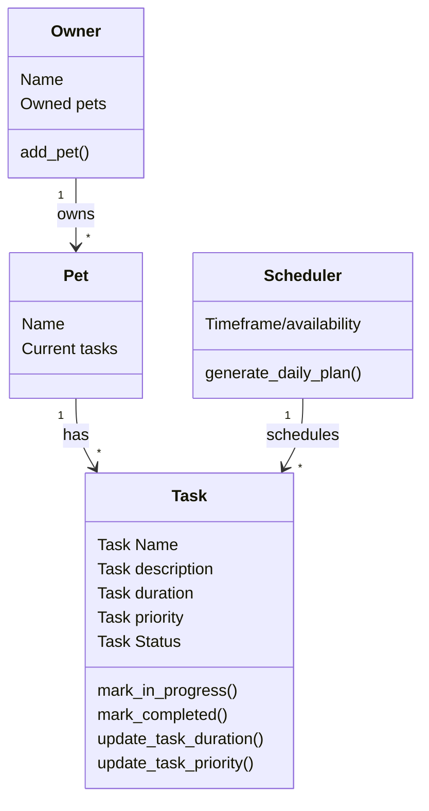

```mermaid
classDiagram
    class Owner {
        Name
        Owned pets
        add_pet()
    }
    class Pet {
        Name
        Current tasks
    }
    class Scheduler {
        Timeframe/availability
        generate_daily_plan()
    }
    class Task {
        Task Name
        Task description
        Task duration
        Task priority
        Task Status
        mark_in_progress()
        mark_completed()
        update_task_duration()
        update_task_priority()
    }
    Owner "1" --> "*" Pet : owns
    Pet "1" --> "*" Task : has
    Scheduler "1" --> "*" Task : schedules
```