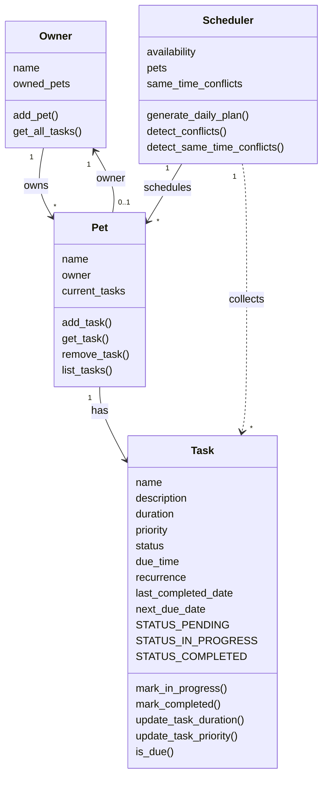

```mermaid
classDiagram
    class Owner {
        name
        owned_pets
        add_pet()
        get_all_tasks()
    }
    class Pet {
        name
        owner
        current_tasks
        add_task()
        get_task()
        remove_task()
        list_tasks()
    }
    class Scheduler {
        availability
        pets
        same_time_conflicts
        generate_daily_plan()
        detect_conflicts()
        detect_same_time_conflicts()
    }
    class Task {
        name
        description
        duration
        priority
        status
        due_time
        recurrence
        last_completed_date
        next_due_date
        STATUS_PENDING
        STATUS_IN_PROGRESS
        STATUS_COMPLETED
        mark_in_progress()
        mark_completed()
        update_task_duration()
        update_task_priority()
        is_due()
    }

    Owner "1" --> "*" Pet : owns
    Pet "0..1" --> "1" Owner : owner
    Pet "1" --> "*" Task : has
    Scheduler "1" --> "*" Pet : schedules
    Scheduler "1" ..> "*" Task : collects
```
